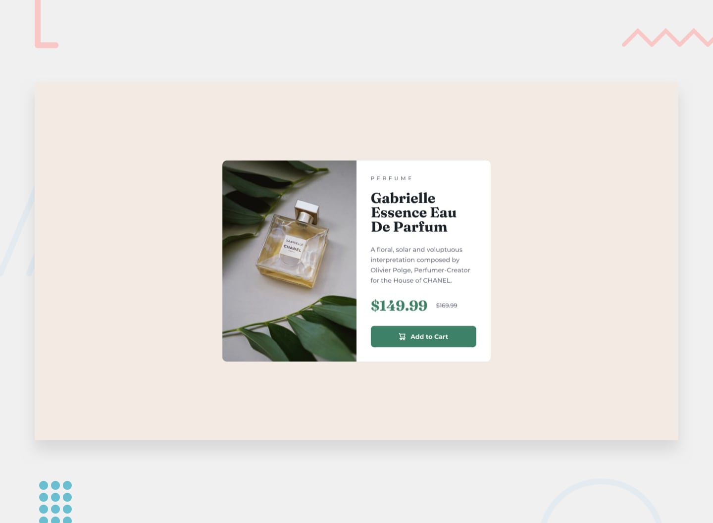

# Frontend Mentor — Composant de carte d’aperçu de produit

## Bienvenue ! 👋

Merci de vous intéresser à ce challenge de développement front-end.

Les challenges de [Frontend Mentor](https://www.frontendmentor.io) vous aident à améliorer vos compétences en développement en construisant des projets réalistes.

**Pour réaliser ce challenge, vous devez avoir une compréhension de base du HTML et du CSS.**

## Le challenge

Votre objectif est de construire ce composant de carte d’aperçu de produit et de faire en sorte qu’il ressemble le plus possible au design fourni.

Vous pouvez utiliser les outils de votre choix pour vous aider à réaliser ce challenge. Si vous souhaitez pratiquer quelque chose en particulier, n’hésitez donc pas à l’utiliser.

Les utilisateurs doivent pouvoir :

- Voir une mise en page adaptée de manière optimale à la taille de l’écran de leur appareil.
- Voir les états `hover` et `focus` des éléments interactifs.

### Besoin d'aide pour le challenge ?

[Rejoignez notre communauté](https://www.frontendmentor.io/community) et posez vos questions dans le canal **#help**.

## Où trouver tout ce dont vous avez besoin

Votre tâche consiste à réaliser le projet à partir des designs présents dans le dossier `/design`. Vous y trouverez une version mobile et une version desktop du design.

Les designs sont fournis au format JPG statique. Comme il s'agit d'images JPG, vous devrez utiliser votre propre jugement pour déterminer des styles tels que `font-size`, `padding` et `margin`.

Si vous souhaitez disposer du fichier de design Figma afin de vous familiariser avec des outils professionnels et de réaliser plus rapidement des projets plus précis, vous pouvez [souscrire à un abonnement PRO](https://www.frontendmentor.io/pro).

Vous trouverez tous les éléments nécessaires dans le dossier `/images`. Les assets sont déjà optimisés.

Vous trouverez également un fichier `style-guide.md` contenant les informations dont vous aurez besoin, notamment la palette de couleurs et les polices.

## Utilisation des assistants de codage IA

Nous avons inclus deux fichiers pour vous aider si vous utilisez des assistants de codage IA (comme Claude, GitHub Copilot, Cursor, etc.) pendant que vous travaillez sur ce challenge :

- `AGENTS.md` — Contient des instructions détaillées destinées aux assistants IA pour les aider avec ce challenge. Elles sont adaptées au niveau de difficulté du challenge afin que l'IA fournisse une aide appropriée à votre niveau d'apprentissage : davantage d'accompagnement pour les challenges débutants et davantage d'autonomie encouragée pour les challenges avancés.
- `CLAUDE.md` — Un fichier qui redirige les outils basés sur Claude vers les instructions contenues dans `AGENTS.md`.

**Comment les utiliser :** Vous n'avez rien à faire ! La plupart des outils de codage IA détectent automatiquement ces fichiers. L'IA les lira et adaptera son comportement afin de devenir un meilleur partenaire d'apprentissage — en vous guidant vers les solutions plutôt qu'en vous donnant simplement les réponses.

**Remarque :** Ces fichiers sont conçus pour vous aider à _apprendre_, et non pour faire le travail à votre place. L'IA est invitée à poser des questions, donner des indices et expliquer les concepts plutôt qu'à écrire des solutions complètes.

## Construire votre projet

N'hésitez pas à utiliser le workflow qui vous convient. Voici une méthode suggérée, mais ne vous sentez pas obligé de suivre exactement ces étapes :

1. Initialisez votre projet en tant que dépôt public sur [GitHub](https://github.com/). Créer un dépôt vous permettra notamment de partager plus facilement votre code avec la communauté si vous avez besoin d'aide. Si vous ne savez pas comment faire, vous pouvez consulter cette ressource [Try Git](https://try.github.io/).

2. Configurez votre dépôt afin de publier votre code à une adresse web. Cela sera également utile si vous avez besoin d'aide pendant un challenge, car vous pourrez partager l'URL de votre projet avec l'URL de votre dépôt. Il existe plusieurs façons de procéder et nous vous proposons plusieurs recommandations ci-dessous.

3. Examinez les designs afin de commencer à planifier la manière dont vous allez aborder le projet. Cette étape est essentielle pour réfléchir à l'avance aux classes CSS que vous allez créer et aux styles que vous pourrez réutiliser.

4. Avant d'ajouter des styles, structurez votre contenu avec du HTML. Écrire d'abord votre HTML peut vous aider à vous concentrer sur la création d'un contenu correctement structuré.

5. Écrivez les styles de base de votre projet, notamment les styles généraux du contenu tels que `font-family` et `font-size`.

6. Commencez à ajouter les styles en partant du haut de la page et en descendant progressivement. Ne passez à la section suivante qu'une fois que vous êtes satisfait du résultat de la zone sur laquelle vous travaillez.

## Mettre votre projet en ligne

Comme indiqué précédemment, il existe de nombreuses façons d'héberger gratuitement votre projet. Les hébergeurs que nous recommandons sont :

- [GitHub Pages](https://pages.github.com/)
- [Vercel](https://vercel.com/)
- [Netlify](https://www.netlify.com/)

Vous pouvez héberger votre site avec l'une de ces solutions ou avec l'un de nos autres fournisseurs de confiance. [En savoir plus sur les hébergeurs que nous recommandons et auxquels nous faisons confiance](https://www.frontendmentor.io/guides/hosting-your-solution).

## Créer un `README.md` personnalisé

Nous vous recommandons fortement de remplacer ce `README.md` par un README personnalisé. Nous avons fourni un modèle dans le fichier [`README-template.md`](./README-template.md) présent dans le code de démarrage.

Le modèle vous donne un guide sur les informations à ajouter. Un README personnalisé vous permettra d'expliquer votre projet et de réfléchir à ce que vous avez appris. N'hésitez pas à modifier notre modèle autant que vous le souhaitez.

Une fois que vous avez ajouté vos informations au modèle, supprimez ce fichier et renommez le fichier `README-template.md` en `README.md`. Il apparaîtra ainsi comme le README de votre dépôt.

## Soumettre votre solution

Soumettez votre solution sur la plateforme afin que le reste de la communauté puisse la voir. Consultez notre [guide complet pour soumettre une solution](https://www.frontendmentor.io/guides/how-to-submit-solutions) pour obtenir des conseils.

N'oubliez pas que si vous recherchez des retours sur votre solution, pensez à poser des questions lorsque vous la soumettez. Plus vos questions seront précises et détaillées, plus vous aurez de chances d'obtenir des retours utiles de la communauté.

## Partager votre solution

Il existe plusieurs endroits où vous pouvez partager votre solution :

1. Partagez la page de votre solution dans le canal **#finished-projects** de la [communauté](https://www.frontendmentor.io/community).

2. Partagez-la sur [X (anciennement Twitter)](https://x.com/frontendmentor) et mentionnez **@frontendmentor**, en incluant dans votre publication les URL de votre dépôt et de votre projet en ligne. Nous serions ravis de découvrir ce que vous avez réalisé et de contribuer à le faire connaître.

3. Partagez votre solution sur [LinkedIn](https://www.linkedin.com/company/frontend-mentor/).

4. Écrivez un article sur votre expérience lors de la réalisation du projet. Écrire sur votre workflow, vos choix techniques et expliquer votre code est une excellente façon de renforcer ce que vous avez appris. Parmi les bonnes plateformes pour écrire, on trouve [dev.to](https://dev.to/), [Hashnode](https://hashnode.com/) et [CodeNewbie](https://community.codenewbie.org/).

Nous fournissons des modèles pour vous aider à partager votre solution une fois que vous l'avez soumise sur la plateforme. Pensez à les modifier et à inclure des questions précises lorsque vous recherchez des retours.

Plus vos questions seront précises, plus il sera probable qu'un autre membre de la communauté puisse vous donner des retours utiles.

## Vous avez des retours à nous donner ?

Nous aimons recevoir vos retours ! Nous cherchons constamment à améliorer nos challenges et notre plateforme. Si vous avez quelque chose à nous signaler, vous pouvez nous écrire à hi[at]frontendmentor[dot]io.

Ce challenge est entièrement gratuit. N'hésitez pas à le partager avec toute personne qui pourrait le trouver utile pour s'entraîner.

**Amusez-vous bien !** 🚀
